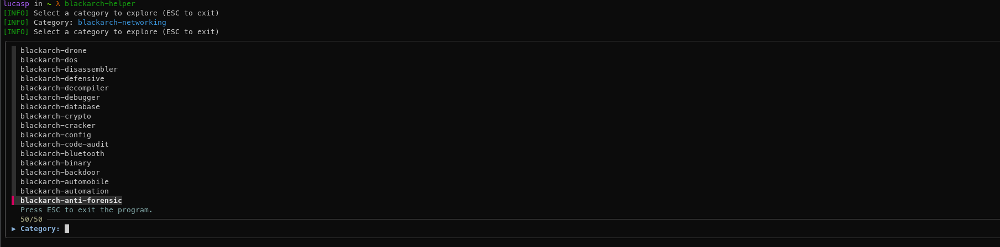
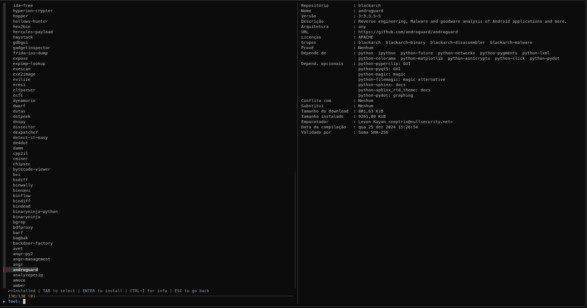

# blackarch-helper

A TUI/CLI helper for exploring and managing tools from the BlackArch repository.

This tool provides an `fzf`-based interactive menu for easy navigation and package management, as well as a standard command-line interface for scripting and automation.
   


## Features

* **Interactive Mode (TUI)**: A fast and fluid text-based interface for browsing categories and tools.
* **Multi-Tool Installation**: Select multiple tools at once using the `TAB` key and install them in a single operation.
* **Package Information**: View package details in a preview pane and which package is already installed.
* **Intuitive Navigation**: Easily move between the category and tool menus.
* **CLI Tool**: Use standard subcommands like `category list` or `tool search` for scripting.
* **Shell Completion**: Includes autocompletion scripts for Bash and Zsh.
* **Lightweight**: A simple Bash script with `fzf` as its main dependency.

## Installation

### From AUR (Recommended)

If you use an AUR helper like `yay` or `paru`, you can install it with a single command:

```bash
yay -S blackarch-helper
```

### From Source

You can also build the package manually from the source code.

```bash
# 1. Clone the repository
git clone https://github.com/x0rgus/blackarch-helper.git

# 2. Change into the directory
cd blackarch-helper

# 3. Build and install the package
makepkg -si
```

## Usage

### Interactive Mode

Run the command without any arguments to launch the interactive TUI.

```bash
blackarch-helper
```

**Controls:**
* **Arrow Keys**: Navigate up and down the list.
* **TAB**: Select or deselect one or more items (in the tool menu).
* **ENTER**: Confirm a selection (enter a category or proceed to install tools).
* **CTRL+I**: Toggles package information preview.
* **ESC**: Go back to the previous menu or exit.

### CLI

The tool can also be used as a traditional CLI application:

| Command                                      | Description                                      |
|----------------------------------------------|------------------------------------------------|
| `blackarch-helper category list`             | List all BlackArch categories.                   |
| `sudo blackarch-helper category install <name>` | Install an entire category (requires root privileges). |
| `blackarch-helper tool list`                  | List all available tools in the repository.     |
| `blackarch-helper tool list-installed`       | List only the installed BlackArch tools.        |
| `blackarch-helper tool search <keyword>`     | Search for a tool containing the specified keyword. |
| `blackarch-helper tool info <package>`       | Get information about a specific package.       |
| `sudo blackarch-helper tool install <package>` | Install a specific package (requires root privileges). |
| `sudo blackarch-helper tool upgrade`         | Upgrade all installed BlackArch tools (requires root privileges). |


## Shell Compatibility

| Shell | Status    | Notes                                                      |
| :---- | :-------- | :--------------------------------------------------------- |
| Bash  | Supported | Full support with autocompletion script provided.          |
| Zsh   | Supported | Full support with autocompletion script provided.          |
| Fish  | Partial   | The script runs correctly, but no completion is provided.  |

## Contributing

Contributions are welcome. Feel free to open an [Issue](https://github.com/x0rgus/blackarch-helper/issues) to report a bug or suggest a feature, or submit a [Pull Request](https://github.com/x0rgus/blackarch-helper/pulls) with improvements.

## License

This project is licensed under the MIT License. See the [LICENSE](LICENSE) file for details.
